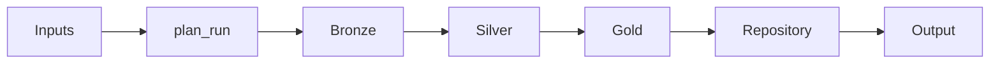

# WorkflowState

The central state object that flows through all LangGraph nodes.

## Overview

`WorkflowState` contains all data accumulated during a workflow run, organized by processing layer.

```python
@dataclass
class WorkflowState:
    # Inputs
    spec_refs: list[str]
    task_description: str
    provider_code: str | None = None
    repo_root: str | None = None
    options: IntegrationOptions | None = None
    
    # Control
    run_id: str = ""
    plan: dict = field(default_factory=dict)
    
    # Bronze Layer
    raw_spec: str = ""
    spec_sha256: str = ""
    
    # Silver Layer
    openapi_spec: dict = field(default_factory=dict)
    spec_documents: list[SpecDocument] = field(default_factory=list)
    endpoints: list[Endpoint] = field(default_factory=list)
    schemas: list[Schema] = field(default_factory=list)
    entities: list[Entity] = field(default_factory=list)
    
    # Gold Layer
    integration_task: IntegrationTask | None = None
    workflow_nodes: list[IntegrationFlowNode] = field(default_factory=list)
    workflow_edges: list[IntegrationFlowEdge] = field(default_factory=list)
    endpoint_bindings: list[EndpointBinding] = field(default_factory=list)
    policies: list[Policy] = field(default_factory=list)
    code_artifacts: list[CodeArtifact] = field(default_factory=list)
    
    # Repository
    repo_profile: RepoProfile | None = None
    repo_changes: RepoChangeSet | None = None
    
    # Diagnostics
    degraded_mode: bool = False
    degraded_reason: str = ""
    llm_fallbacks: list[str] = field(default_factory=list)
    node_timings: dict[str, float] = field(default_factory=dict)
    errors: list[str] = field(default_factory=list)
    
    # Output
    report: str = ""
```

## Layer Organization

### Input Fields

Set before the workflow starts:

| Field | Type | Description |
|-------|------|-------------|
| `spec_refs` | `list[str]` | Paths/URLs to API specs |
| `task_description` | `str` | User's task in natural language |
| `provider_code` | `str \| None` | Provider identifier |
| `repo_root` | `str \| None` | Target repository path |
| `options` | `IntegrationOptions` | Run configuration |

### Control Fields

Set by `plan_run` node:

| Field | Type | Description |
|-------|------|-------------|
| `run_id` | `str` | UUID for this run |
| `plan` | `dict` | Run plan with flags like `use_repo` |

### Bronze Layer

Raw input data:

| Field | Type | Description |
|-------|------|-------------|
| `raw_spec` | `str` | Raw spec file content |
| `spec_sha256` | `str` | Content hash for deduplication |

### Silver Layer

Normalized API surface:

| Field | Type | Description |
|-------|------|-------------|
| `openapi_spec` | `dict` | Parsed OpenAPI document |
| `spec_documents` | `list[SpecDocument]` | Spec metadata |
| `endpoints` | `list[Endpoint]` | API operations |
| `schemas` | `list[Schema]` | Data schemas |
| `entities` | `list[Entity]` | Business objects |

### Gold Layer

Task-specific design:

| Field | Type | Description |
|-------|------|-------------|
| `integration_task` | `IntegrationTask` | Task definition |
| `workflow_nodes` | `list[IntegrationFlowNode]` | Workflow steps |
| `workflow_edges` | `list[IntegrationFlowEdge]` | Step connections |
| `endpoint_bindings` | `list[EndpointBinding]` | Node→endpoint mappings |
| `policies` | `list[Policy]` | Auth, retry, etc. policies |
| `code_artifacts` | `list[CodeArtifact]` | Generated code |

### Repository Fields

For repo integration:

| Field | Type | Description |
|-------|------|-------------|
| `repo_profile` | `RepoProfile` | Repository configuration |
| `repo_changes` | `RepoChangeSet` | Proposed file changes |

### Diagnostic Fields

For debugging and observability:

| Field | Type | Description |
|-------|------|-------------|
| `degraded_mode` | `bool` | True if fallbacks were used |
| `degraded_reason` | `str` | Why degraded mode was entered |
| `llm_fallbacks` | `list[str]` | Nodes that used fallback paths |
| `node_timings` | `dict[str, float]` | Per-node execution times |
| `errors` | `list[str]` | Accumulated error messages |

## State Transitions



1. **Inputs → Bronze**: `ingest_spec` loads raw spec content
2. **Bronze → Silver**: `build_silver_api_model` extracts API surface
3. **Silver → Gold**: `understand_task` through `generate_code_and_tests`
4. **Gold → Repository**: `attach_repo_context` through `apply_repo_integration_changes`
5. **Repository → Output**: `build_report` generates final output

## Accessing State in Nodes

Nodes receive and return `WorkflowState`:

```python
def my_node(state: WorkflowState) -> WorkflowState:
    # Read from state
    endpoints = state.endpoints
    
    # Modify state
    state.code_artifacts.append(new_artifact)
    state.node_timings["my_node"] = elapsed_time
    
    return state
```

---

::: integration_coworker.graph.state.WorkflowState
    options:
      show_source: true
      show_root_heading: true

---

[Back to Types](types.md) | [Features →](../features/knowledge-graph.md)
