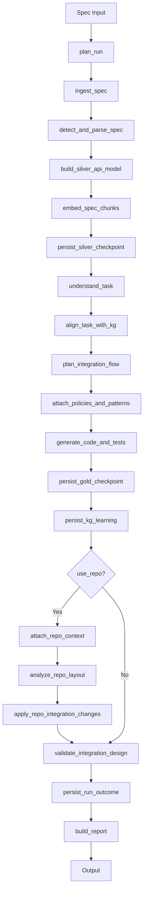

# Architecture Reference

> **Status**: Active (Production-critical)
>
> **Last Updated**: December 2025

---

## High-level Overview

The **Agentic Integration Designer** takes an API specification (OpenAPI/Swagger) and a plain-English task description, then automatically generates working Python client code, workflow functions, and tests for that specific integration.

### Core Value Proposition

Instead of a developer manually reading API specs and writing integration code, this agent:

1. **Parses** specs (OpenAPI, HTML, PDF)
2. **Normalizes** the API surface into a structured **Silver** model
3. **Plans** a task-specific workflow based on knowledge graph patterns → **Gold** model
4. **Generates** syntactically valid, pattern-compliant code
5. **Wires** the code into a target repository (optional)
6. **Persists** all design decisions for reuse

---

## Data Flow



**Entry Points**:
- **CLI**: `integration_coworker.cli` → parses args → calls entrypoint
- **Python API**: `design_and_generate_integration()` in `api/entrypoint.py`

---

## Silver–Gold Medallion Model

| Layer | Purpose | Examples |
|-------|---------|----------|
| **Bronze** | Raw inputs | Spec files, SHA256 hashes |
| **Silver** | Normalized API surface | Endpoints, Schemas, Entities |
| **Gold** | Task-specific design | Workflow nodes, Endpoint bindings, Generated code |

### Silver Layer Tables
- `source_systems` → API providers
- `spec_documents` → OpenAPI specs
- `endpoints` → API operations
- `schemas` → JSON schemas
- `entities` → business objects

### Gold Layer Tables
- `integration_tasks` → task definitions
- `integration_flow_nodes` → workflow nodes
- `integration_flow_edges` → workflow edges
- `endpoint_bindings` → node→endpoint mappings
- `code_artifacts` → generated code

---

## Main Components

### Entry Points
| File | Purpose |
|------|---------|
| `src/integration_coworker/api/entrypoint.py` | Main API function |
| `src/integration_coworker/cli.py` | CLI argument parsing |

### State Management
| File | Purpose |
|------|---------|
| `src/integration_coworker/graph/state.py` | `WorkflowState`, `IntegrationResult` |
| `src/integration_coworker/graph/runtime.py` | Graph wiring, conditional routing |

### Node Implementations
| Category | Files |
|----------|-------|
| Ingestion | `plan_run.py`, `ingest_spec.py`, `detect_and_parse_spec.py` |
| Silver | `build_silver_api_model.py`, `embed_spec_chunks.py`, `persist_silver_checkpoint.py` |
| Gold | `understand_task.py`, `align_task_with_kg.py`, `plan_integration_flow.py` |
| Generation | `attach_policies_and_patterns.py`, `generate_code_and_tests.py`, `persist_gold_checkpoint.py`, `persist_kg_learning.py` |
| Repo | `attach_repo_context.py`, `analyze_repo_layout.py`, `apply_repo_integration_changes.py` |
| Finalization | `validate_integration_design.py`, `handle_error.py`, `build_report.py`, `persist_run_outcome.py` |

---

## External Dependencies

| Dependency | Purpose | Required |
|------------|---------|----------|
| **Python 3.11+** | Runtime | Yes |
| **SQLite** or **Postgres+pgvector** | Persistence | Yes (SQLite default) |
| **OpenAI API** | Embeddings, report summarization | Yes |
| **Anthropic API** | Task understanding, planning, codegen | Yes (for LLM path) |
| **LangGraph** | Workflow orchestration | Yes |
| **Redis** | LLM response cache | Optional |
| **LangSmith** | Observability & tracing | Optional |

---

## Agent Behavior Bounds

### What the Agent WILL Do ✅

| Capability | Bound |
|------------|-------|
| Parse OpenAPI specs | Up to ~20MB per spec |
| Multiple specs per run | Unlimited |
| Generate client/workflow/test code | Always produces something |
| Validate code syntax | Always runs AST check |
| Produce a report | Always (even on errors) |

### What the Agent WILL NOT Do ❌

| Non-Capability | Workaround |
|----------------|------------|
| Generate semantically correct code | Requires human review |
| Execute the generated code | Manual testing required |
| Write files to disk | Returns `RepoChangeSet` only |
| Support non-Python runtimes | Python 3.11+ only |

### Outer Bounds

```
MAX SPEC SIZE:        ~20 MB per document
MAX SPECS PER RUN:    Unlimited (memory-bound)
MAX ENDPOINTS:        ~1000 per spec
MAX RUN TIME:         ~5 minutes (design target)
OUTPUT LANGUAGES:     Python only
LLM DEPENDENCY:       Required for planning
DB DEPENDENCY:        SQLite (default) or Postgres+pgvector
```

---

## Repo Profile System

The Repository Profile system enables automatic detection of a target repository's structure.

### Known Archetypes

| Archetype | Language | Default Integrations Root |
|-----------|----------|--------------------------|
| `fastapi` | Python | `app/integrations` |
| `django-rest` | Python | `integrations` |
| `flask` | Python | `app/integrations` |
| `next-js-app-router` | TypeScript | `lib/integrations` |
| `nestjs` | TypeScript | `src/integrations` |
| `express` | TypeScript | `src/integrations` |
| `generic-python` | Python | `src/integrations` |
| `generic-typescript` | TypeScript | `src/integrations` |

---

## Hybrid Retrieval (KG + Semantic Search)

This system combines **structural graph traversal** over a knowledge graph (KG) with **semantic search** over embeddings.

### Hybrid Strategy (GraphRAG)

For template selection:
1. **Graph filter**: Find candidates via BFS/DFS
2. **Semantic ranking**: Score by embedding similarity
3. **Combined scoring**: Graph score (40%) + embedding score (40%) + exact match bonus (20%)

---

## Quick Reference

**Entry Point**:
```python
from integration_coworker.api.entrypoint import design_and_generate_integration

result = design_and_generate_integration(
    spec_refs=["path/to/openapi.yaml"],
    task_description="Create checkout session",
    provider_code="stripe",
    options=IntegrationOptions(dry_run=True)
)
```

**Key State Transitions**:
1. Inputs → WorkflowState (spec_refs, task_description)
2. Bronze → openapi_spec (parsed dict)
3. Silver → endpoints, schemas, entities
4. Gold → integration_task, workflow_nodes, code_artifacts
5. Output → IntegrationResult (run_id, status, artifacts, report)

---

[Back to Recovery](../features/recovery.md) | [Code Tour →](code-tour.md)
