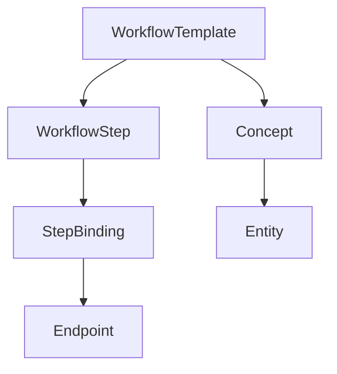

# Knowledge Graph

The Knowledge Graph (KG) is a central component that stores learned patterns and enables intelligent workflow planning.

## Overview

The KG stores:

- **Workflow Templates**: Pre-defined patterns for common integration tasks
- **Workflow Steps**: Individual operations within templates
- **Step-Endpoint Bindings**: Mappings from steps to API endpoints
- **Learned Patterns**: Successful patterns from past runs

## Structure



### Tables

| Table | Purpose |
|-------|---------|
| `kg_workflow_templates` | Template definitions |
| `kg_workflow_steps` | Steps within templates |
| `kg_step_bindings` | Step → endpoint mappings |
| `kg_concepts` | Abstract concepts |
| `kg_concept_links` | Concept relationships |

## Workflow Templates

Pre-defined templates for common patterns:

| Template | Description | Steps |
|----------|-------------|-------|
| `crud_resource` | CRUD operations | validate → create/read/update/delete → transform → return |
| `authentication_flow` | Auth setup | validate_creds → authenticate → store_token → return |
| `webhook_handler` | Incoming webhooks | parse_payload → validate_signature → process → acknowledge |
| `batch_processing` | Bulk operations | validate → paginate → process_batch → aggregate → return |
| `search_and_filter` | Query with pagination | build_query → execute → paginate → transform → return |

## Template Matching

The `align_task_with_kg` node matches tasks to templates using:

### 1. Keyword Matching

Task descriptions are tokenized and matched against template keywords:

```python
# Template: crud_resource
keywords: ["create", "read", "update", "delete", "list", "get", "post", "put"]
```

### 2. Endpoint Pattern Matching

API endpoints are matched to template steps:

```python
# If spec has POST /users, GET /users/{id}, PUT /users/{id}, DELETE /users/{id}
# → matches crud_resource template
```

### 3. Schema Structure Matching

Request/response schemas are analyzed for template fit:

```python
# If schema has "id", "created_at", "updated_at" fields
# → likely a CRUD resource
```

### 4. Hybrid Scoring

Final scores combine:

- Graph traversal score (40%)
- Embedding similarity (40%)
- Exact match bonus (20%)

## CLI Commands

### Export Knowledge Graph

```bash
integration-coworker kg-dump --output kg-export.json
```

### Query the Graph

```bash
integration-coworker kg-query "payment processing"
```

### View Template Confidence

```bash
integration-coworker kg-confidence
```

## Programmatic Access

```python
from integration_coworker.kg import get_kg_client

kg = get_kg_client()

# Find templates for a task
templates = kg.find_templates_for_task("Create a checkout session")

# Get template details
template = kg.get_template("crud_resource")

# Add learned pattern
kg.add_learned_pattern(
    source_run_id="abc-123",
    pattern_type="checkout_flow",
    endpoints=["POST /checkout/sessions"],
    success_rate=0.95
)
```

## Learning from Runs

After successful runs, patterns are persisted:

1. **persist_kg_learning** node extracts patterns from the run
2. Patterns include endpoint combinations, step sequences, and policies
3. Future runs benefit from learned patterns via similarity matching

## GraphRAG Integration

The KG is combined with semantic search for "GraphRAG" retrieval:

1. **Graph Filter**: Find candidates via BFS/DFS traversal
2. **Semantic Ranking**: Score by embedding similarity to task
3. **Combined Scoring**: Weighted combination of graph and semantic scores

This hybrid approach provides:

- Structural awareness from the graph
- Semantic flexibility from embeddings
- Better coverage than either approach alone

---

[Back to WorkflowState](../api-reference/workflow-state.md) | [LLM Cache →](llm-cache.md)
