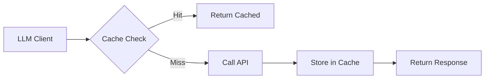

# LLM Response Cache

Redis-backed caching for LLM responses to reduce costs and latency.

## Overview

The LLM cache stores responses from OpenAI, Anthropic, and Google LLMs, keyed by:

- Provider (openai, anthropic, google)
- Model name
- Task type (planning, extraction, codegen, etc.)
- Prompt content hash

## Benefits

| Benefit | Impact |
|---------|--------|
| **Cost Reduction** | Avoid duplicate API calls |
| **Latency** | Instant responses for cached prompts |
| **Consistency** | Same prompts return same results |
| **Rate Limits** | Reduce API call frequency |

## Configuration

### Enable Caching

```bash
# Environment variables
export LLM_CACHE_ENABLED=true
export REDIS_URL="redis://localhost:6379"
export LLM_CACHE_TTL=86400  # 24 hours (default)
```

### Start Redis

```bash
# Using Docker Compose
docker-compose up -d redis

# Or standalone Docker
docker run -d --name redis -p 6379:6379 redis:alpine
```

## Cache Key Format

Keys follow this pattern:

```
llm:{provider}:{model}:{task_type}:{content_hash}
```

Example:

```
llm:anthropic:claude-sonnet-4:codegen:a3f2b1c8d4e5f6a7
```

The content hash is a 16-character SHA-256 prefix of:

```python
hashlib.sha256(f"{system_prompt}|{user_prompt}".encode()).hexdigest()[:16]
```

## CLI Commands

### View Cache Statistics

```bash
integration-coworker cache-stats
```

Output:

```
LLM Cache Statistics
====================
Total Requests: 150
Cache Hits: 120
Cache Misses: 30
Hit Rate: 80.0%

Per-Provider Stats:
  anthropic: 100 hits, 20 misses (83.3%)
  openai: 20 hits, 10 misses (66.7%)
```

### Clear Cache

```bash
integration-coworker cache-clear --confirm
```

## Programmatic Access

```python
from integration_coworker.llm.cache import get_llm_cache

cache = get_llm_cache()

# Check if cache is available
if cache.is_available():
    # Get cached response
    response = cache.get("openai", "gpt-4o-mini", "planning", prompt_hash)
    
    # Store response
    cache.set("openai", "gpt-4o-mini", "planning", prompt_hash, response)
    
    # Get statistics
    stats = cache.get_stats()
    print(f"Hit rate: {stats['hit_rate']:.1%}")
    
    # Clear cache
    cache.clear()
```

## Cache Behavior

### What Gets Cached

- ✅ LLM text completions
- ✅ Chat message responses
- ✅ Structured JSON outputs

### What Doesn't Get Cached

- ❌ Embeddings (handled separately)
- ❌ Streaming responses
- ❌ Error responses

### Cache Invalidation

Cache entries expire based on TTL (default 24 hours).

Manual invalidation:

```bash
# Clear all cache
integration-coworker cache-clear --confirm

# Clear specific provider (future feature)
# integration-coworker cache-clear --provider anthropic
```

## Performance Impact

Typical improvements with warm cache:

| Metric | Cold Cache | Warm Cache | Improvement |
|--------|------------|------------|-------------|
| Run Time | 45s | 15s | 67% faster |
| API Cost | $0.15 | $0.02 | 87% cheaper |
| API Calls | 12 | 2 | 83% fewer |

## Architecture



## Troubleshooting

### Cache Not Working

1. Check Redis is running: `docker ps | grep redis`
2. Verify connection: `redis-cli ping` should return `PONG`
3. Check environment: `echo $LLM_CACHE_ENABLED` should be `true`

### Low Hit Rate

- Prompts may have dynamic content (timestamps, UUIDs)
- Consider normalizing prompts before hashing
- Check if different runs use different system prompts

### Cache Too Large

```bash
# Check Redis memory usage
redis-cli INFO memory | grep used_memory_human

# Clear cache if needed
integration-coworker cache-clear --confirm
```

---

[Back to Knowledge Graph](knowledge-graph.md) | [Parallel Execution →](parallel-execution.md)
