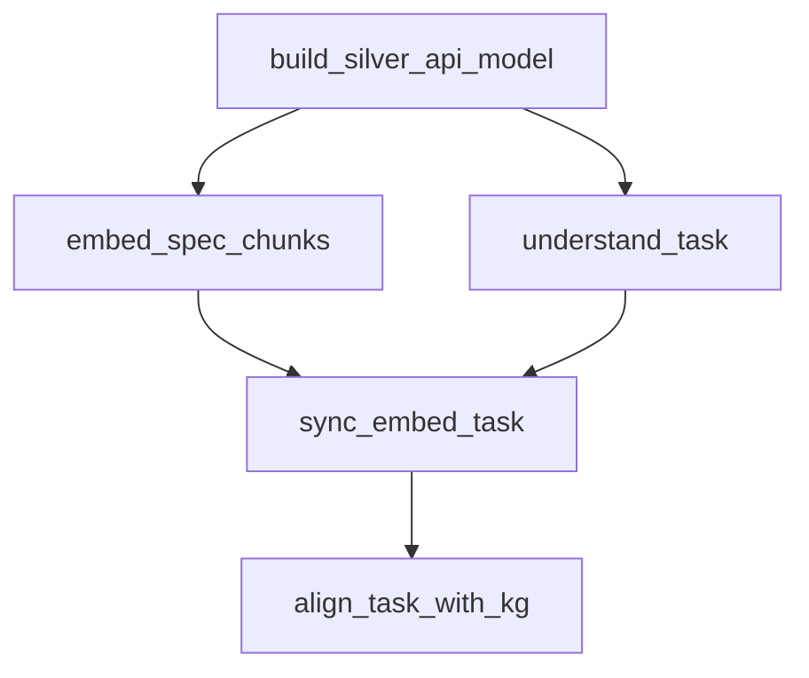

# Parallel Execution

Run independent workflow nodes concurrently for faster execution.

## Overview

By default, Integration Co-Worker runs nodes sequentially. With parallel execution enabled, independent nodes run concurrently, reducing total execution time.

## Enabling Parallel Execution

```bash
export PARALLEL_WORKFLOW=true
```

Or in Python:

```python
import os
os.environ["PARALLEL_WORKFLOW"] = "true"
```

## Parallel Nodes

When enabled, the following nodes run in parallel after `build_silver_api_model`:



### Parallel Branch 1: Embedding

- `embed_spec_chunks`: Generate embeddings for spec chunks
- Independent of task understanding

### Parallel Branch 2: Task Understanding

- `understand_task`: Parse and normalize the task description
- Independent of embedding generation

### Sync Point

- `sync_embed_task`: Synchronization barrier
- Waits for both branches to complete
- Merges results into unified state

## Performance Impact

Typical improvements:

| Spec Size | Sequential | Parallel | Improvement |
|-----------|------------|----------|-------------|
| Small (10 endpoints) | 20s | 15s | 25% faster |
| Medium (50 endpoints) | 45s | 30s | 33% faster |
| Large (200 endpoints) | 90s | 55s | 39% faster |

## How It Works

### Graph Construction

```python
from integration_coworker.graph.parallel import build_parallel_graph

# Called automatically when PARALLEL_WORKFLOW=true
graph = build_parallel_graph()
```

### Sync Node Implementation

```python
def sync_embed_task(state: WorkflowState) -> WorkflowState:
    """Synchronization point for parallel branches."""
    # Both branches have completed at this point
    # State contains results from embed_spec_chunks AND understand_task
    return state
```

### Runtime Selection

```python
def run_workflow(state: WorkflowState) -> IntegrationResult:
    if is_parallel_workflow_enabled():
        graph = build_parallel_graph()
    else:
        graph = build_graph()  # Sequential
    
    return graph.invoke(state)
```

## Limitations

### Not Parallelized

Some nodes cannot be parallelized due to dependencies:

- `ingest_spec` → `detect_and_parse_spec` (sequential input processing)
- `plan_integration_flow` → `generate_code_and_tests` (flow needed for codegen)
- All persistence nodes (database ordering)

### Resource Considerations

Parallel execution uses more:

- **Memory**: Multiple node states in memory
- **CPU**: Concurrent processing
- **API calls**: Parallel LLM requests (if not cached)

### Error Handling

If one parallel branch fails:

1. Other branches complete
2. Error is captured at sync point
3. Workflow continues in degraded mode if possible

## Testing

Run the parallel execution tests:

```bash
pytest tests/test_parallel_execution.py -v
```

## Programmatic Control

```python
from integration_coworker.graph.parallel import is_parallel_workflow_enabled

# Check if parallel mode is enabled
if is_parallel_workflow_enabled():
    print("Running in parallel mode")
else:
    print("Running in sequential mode")
```

## Best Practices

### When to Use Parallel Mode

- ✅ Large specs with many endpoints
- ✅ When embedding and task understanding are bottlenecks
- ✅ Production workloads with adequate resources

### When to Use Sequential Mode

- ✅ Debugging and development
- ✅ Resource-constrained environments
- ✅ When deterministic ordering is important

## Observability

Check parallel execution in run metrics:

```python
result = design_and_generate_integration(...)

# Parallel mode indicator
print(f"Parallel: {result.metrics.get('parallel_mode', False)}")

# Per-node timings
for node, timing in result.metrics.get('node_timings', {}).items():
    print(f"{node}: {timing:.2f}s")
```

---

[Back to LLM Cache](llm-cache.md) | [Recovery →](recovery.md)
