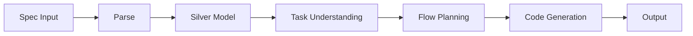

# Integration Co-Worker

**Agentic API Integration Designer & Code Generator**

Integration Co-Worker is a LangGraph-powered tool that transforms OpenAPI specifications into production-ready integration code.

## Features

- 🔍 **Multi-format Spec Support** - OpenAPI, AsyncAPI, HTML, PDF
- 🧠 **LLM-Powered Planning** - Understands your task, plans the workflow
- 💻 **Multi-Language Codegen** - Python, TypeScript, Go, Java
- 📊 **Knowledge Graph** - Learns and reuses patterns
- 🔄 **Resumable Runs** - Checkpoint-based recovery
- ⚡ **LLM Response Cache** - Redis-backed caching for cost reduction
- 🚀 **Parallel Execution** - Concurrent node execution for faster runs

## Quick Start

```bash
pip install integration-coworker

integration-coworker run \
  --spec-ref https://api.example.com/openapi.yaml \
  --task "Create a payment checkout flow"
```

## How It Works

Integration Co-Worker follows a structured pipeline:



1. **Ingest**: Parse OpenAPI/Swagger specifications
2. **Normalize**: Build a structured "Silver" model of the API surface
3. **Understand**: Match your task against known workflow patterns
4. **Plan**: Design a task-specific integration workflow
5. **Generate**: Produce client code, workflow orchestration, and tests
6. **Output**: Return artifacts ready for integration

## Documentation Overview

| Section | Description |
|---------|-------------|
| [Getting Started](getting-started/installation.md) | Installation and setup |
| [User Guide](user-guide/cli-reference.md) | CLI and UI documentation |
| [API Reference](api-reference/entrypoint.md) | Python API documentation |
| [Features](features/knowledge-graph.md) | Feature deep-dives |
| [Development](development/architecture.md) | Architecture and contributing |

## License

MIT License - see [LICENSE](https://github.com/julianbartosz/solver-agentic-spec-coworker/blob/main/LICENSE) for details.

---

[Get Started →](getting-started/installation.md){ .md-button .md-button--primary }
