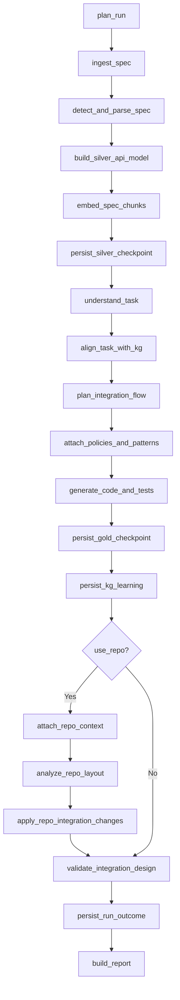
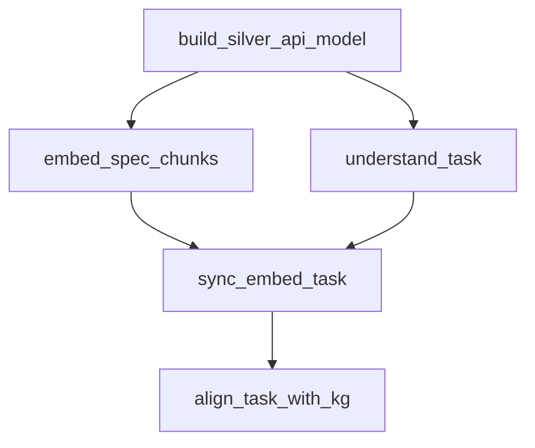

# Workflows

Understanding how Integration Co-Worker processes your integration requests.

## Workflow Overview

The system follows a structured 22-node LangGraph pipeline:



## Node Categories

### Ingestion Nodes

| Node | Purpose |
|------|---------|
| `plan_run` | Validate inputs, generate run_id, set flags |
| `ingest_spec` | Load spec file/URL, compute SHA256 |
| `detect_and_parse_spec` | Identify format, parse to dict |

### Silver Model Nodes

| Node | Purpose |
|------|---------|
| `build_silver_api_model` | Extract endpoints, schemas, entities |
| `embed_spec_chunks` | Generate embeddings for semantic search |
| `persist_silver_checkpoint` | Stream Silver layer to database |

### Gold Model Nodes

| Node | Purpose |
|------|---------|
| `understand_task` | Normalize task, derive constraints |
| `align_task_with_kg` | Match against workflow templates |
| `plan_integration_flow` | Build workflow node/edge graph |
| `attach_policies_and_patterns` | Add auth, retry, rate limit policies |
| `generate_code_and_tests` | Produce client, flow, test artifacts |
| `persist_gold_checkpoint` | Stream Gold layer to database |
| `persist_kg_learning` | Update knowledge graph with patterns |

### Repository Nodes (Conditional)

| Node | Purpose |
|------|---------|
| `attach_repo_context` | Load or infer repo profile |
| `analyze_repo_layout` | Scan directory structure |
| `apply_repo_integration_changes` | Generate file patches |

### Finalization Nodes

| Node | Purpose |
|------|---------|
| `validate_integration_design` | Enforce flow structure rules |
| `handle_error` | Handle node failures |
| `persist_run_outcome` | Record final status |
| `build_report` | Generate markdown report |

## Parallel Execution

When `PARALLEL_WORKFLOW=true`, certain nodes run concurrently:



This can reduce total execution time by 30-40%.

## Workflow Templates

The knowledge graph contains pre-defined workflow templates:

| Template | Use Case |
|----------|----------|
| `crud_resource` | Create/Read/Update/Delete operations |
| `authentication_flow` | OAuth, API key setup |
| `webhook_handler` | Incoming webhook processing |
| `batch_processing` | Bulk data operations |
| `search_and_filter` | Query with pagination |

Templates are matched based on:

1. Task description keywords
2. Endpoint patterns (CRUD verbs)
3. Schema structures
4. Historical usage patterns

## Error Handling

Errors are handled gracefully:

1. **Validation failures** route through `handle_error`
2. **Reports are always generated** even after errors
3. **Degraded mode** is marked when fallbacks are used

Degraded mode fields:

- `degraded_mode`: Boolean flag
- `degraded_reason`: Explanation string
- `llm_fallbacks`: List of nodes that used fallback paths

## Checkpointing

Runs are checkpointed for recovery:

- Silver checkpoint after API model extraction
- Gold checkpoint after code generation
- Run outcome persisted at completion

Resume interrupted runs:

```bash
integration-coworker resume --run-id <RUN_ID>
```

---

[Back to Specs](specs.md) | [API Reference →](../api-reference/entrypoint.md)
